代码实现方案链接：[全国公共政策平台](https://github.com/yelantingxue0808/crawlProject/tree/main/js%E9%80%86%E5%90%91%E4%B8%93%E9%A2%98%E9%A1%B9%E7%9B%AE/%E5%85%A8%E5%9B%BD%E5%85%AC%E5%85%B1%E6%94%BF%E7%AD%96%E5%B9%B3%E5%8F%B0)
网页链接：[http://www.spolicy.com/](http://www.spolicy.com/)

# 全国公共政策大数据平台 —— 逆向分析

> 本文记录了对「全国公共政策大数据平台」前端接口的一次逆向过程，包括：反调试（无限 `debugger`）的绕过、加密请求的定位、`webpack` 模块的还原，以及最终通过「抠代码 + 补环境 + `execjs` 调用」破解加密参数的完整思路。

---

## 一、反调试：处理无限 debugger

### 1.1 现象

打开 F12 开发者工具后，页面陷入无限 `debugger`，无法正常调试。这是目标站点设置的 **反调试（Anti-Debugging）** 机制。

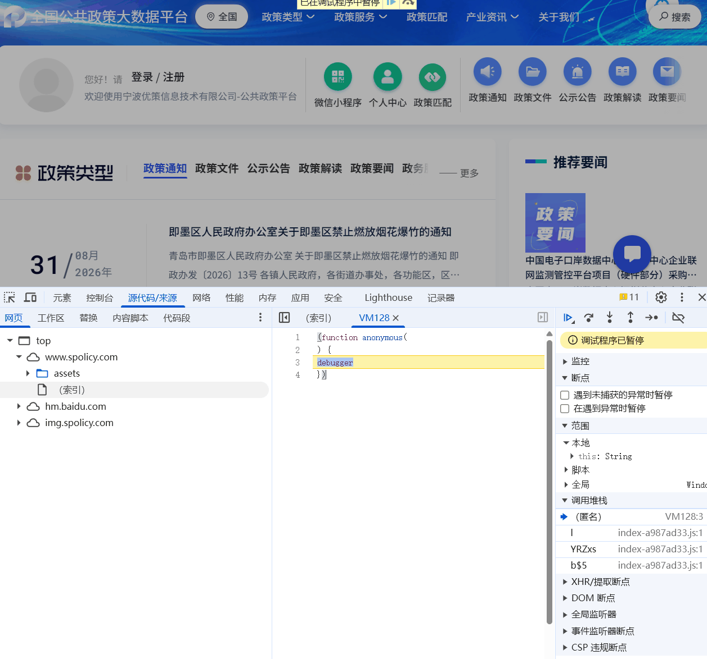

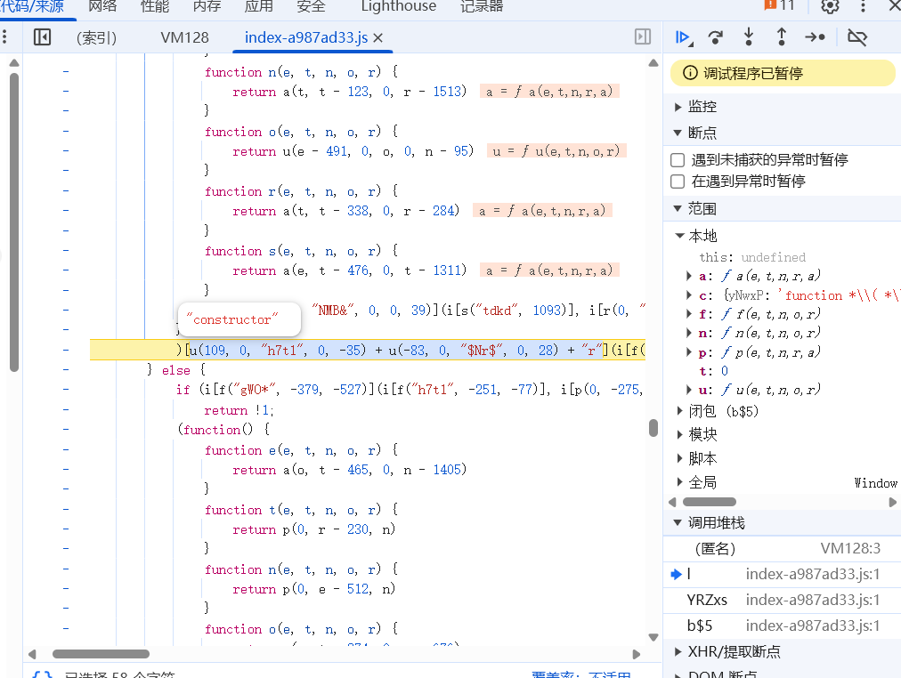

### 1.2 定位

从调用栈向上回溯，可以定位到这是一个通过「大 `Function`」构造实现的 `debugger`。

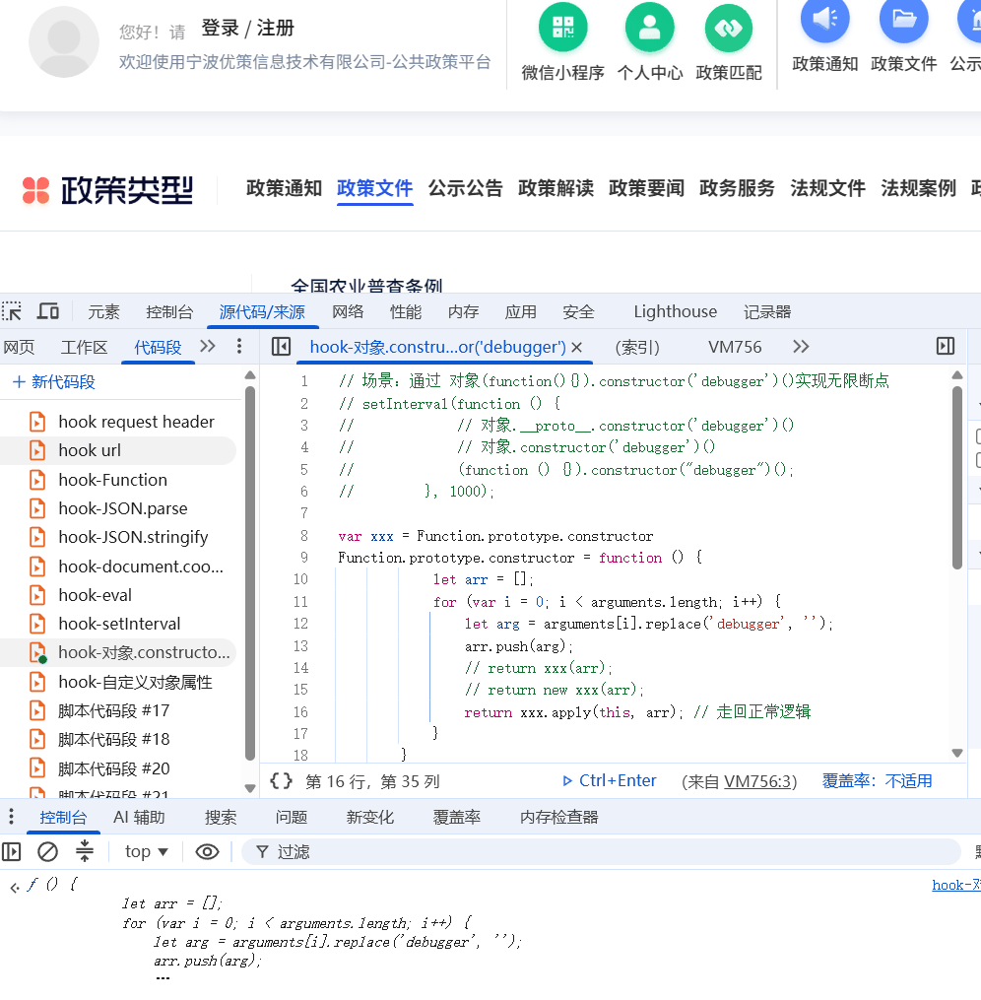

### 1.3 方法一：Hook 注入，重写 Function 剔除 debugger

通过 Hook 注入的方式重写 `Function` 构造函数，把其中拼接的 `debugger` 语句剔除。**关键点：Hook 代码必须先于目标函数执行**，否则无法拦截。

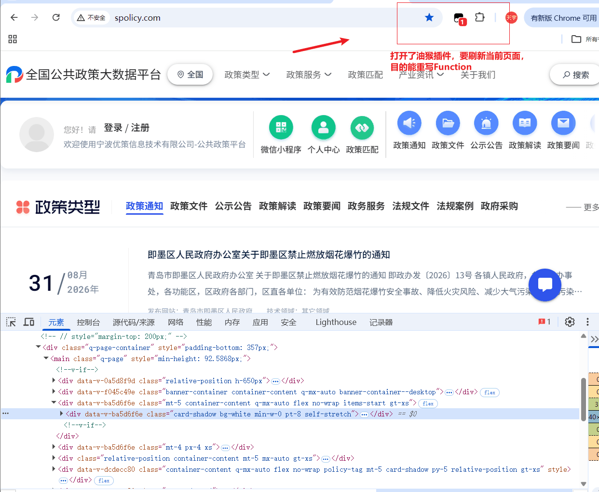

### 1.4 方法二：油猴脚本（Tampermonkey）

借助油猴插件，在页面加载时提前重写 `Function`，同样将 `debugger` 剔除。

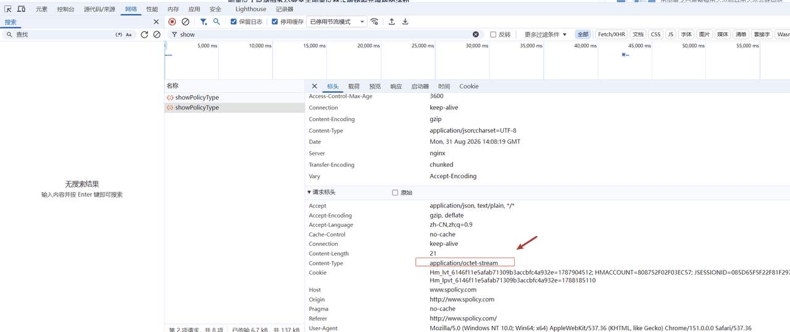

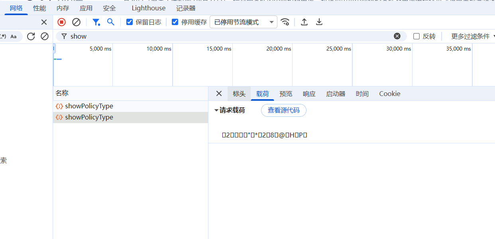

---

## 二、定位加密请求

### 2.1 触发请求并观察特征

触发点击事件后，页面调用 JS 发起异步网络请求。在 Source 面板中找到对应的异步请求地址：

- 它是一个 **POST** 请求；
- 连续多次请求可以发现，**请求载荷（payload）中的参数是加密的**；
- 请求头 `Content-Type` 为 **`application/octet-stream`**（二进制格式）。

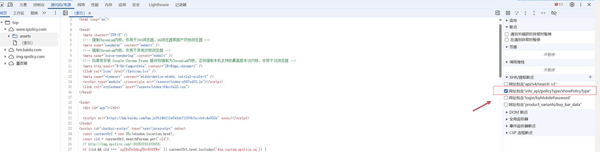

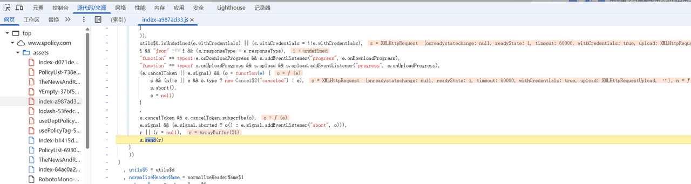

### 2.2 通过 XHR 断点定位发送位置

在 Source 面板中对 **XHR** 打上断点，再次触发点击事件，代码断在 XHR 请求发送的位置。

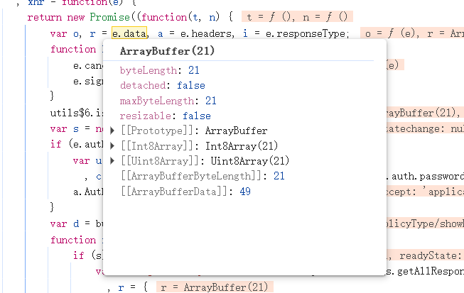

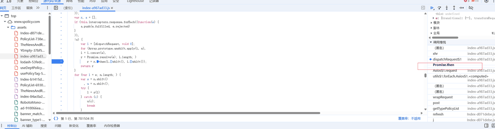

### 2.3 回溯调用栈：Promise 异步对象

向上观察可以发现，此时 `data` 已经被加密成二进制格式。通过调用栈向上回溯，发现这是一个 **`Promise` 异步操作对象**：

- 它属于异步操作，**不能当作同步代码执行**；
- 需要拿到 `.then()` 中的结果；
- 在相应代码处打断点，执行脚本并触发点击事件，让代码断在此处。

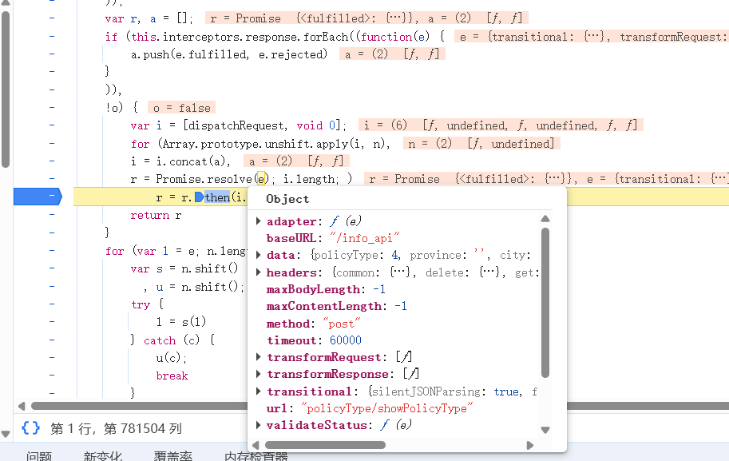

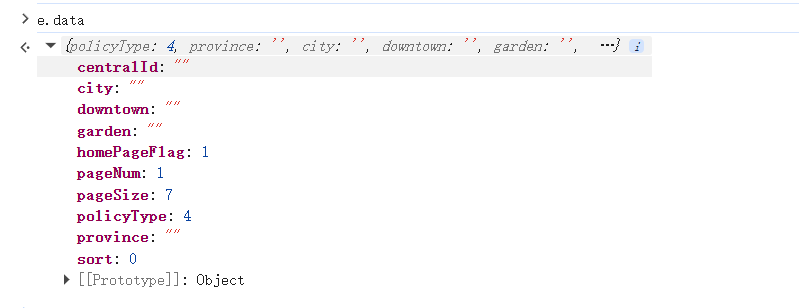

---

## 三、定位加密前的参数与加密点

### 3.1 打印加密前参数

观察到 `Promise` 状态为 `fulfilled`，在控制台打印出当前 `data` 对象的值——这就是**加密前的参数**。接下来需要找到加密发生的位置。

如果直接一步一步向下执行来寻找，异步流程逐步追踪非常困难，因此换一个思路。

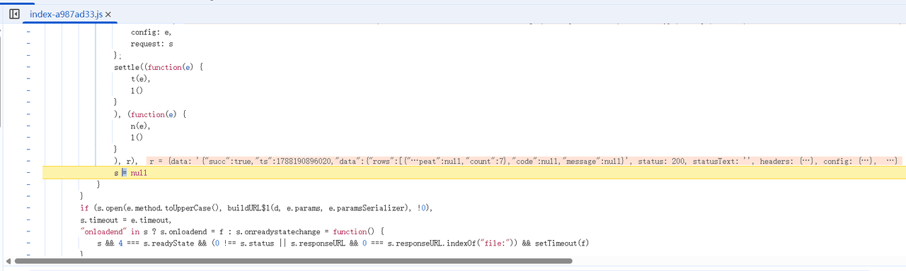

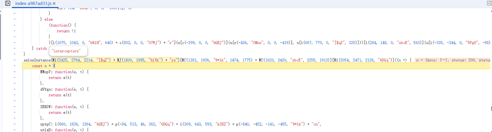

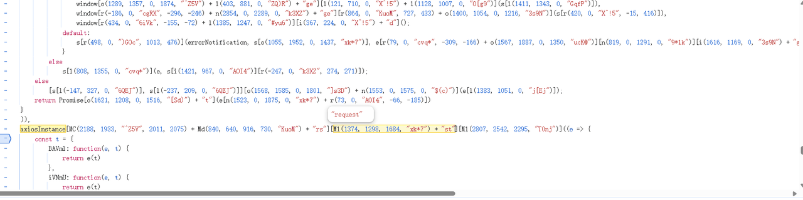

### 3.2 通过 axiosInstance 定位请求拦截器

可以从 XHR 发出的请求一步步向下执行，直到找到服务器返回的数据。该数据会经过**响应拦截器**（动态修改）处理后再渲染到页面上。

继续向下执行可以看到响应拦截器；通过关键字 **`axiosInstance`** 搜索，定位到了**请求拦截器**。请求载荷中的数据一定是在请求拦截器中加密的。在请求拦截器的代码处打断点，执行脚本并再次触发点击事件，让代码进入请求拦截器。

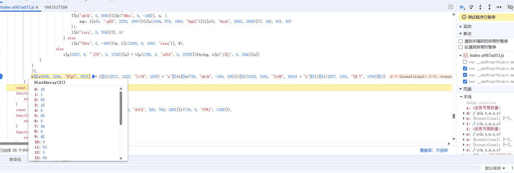

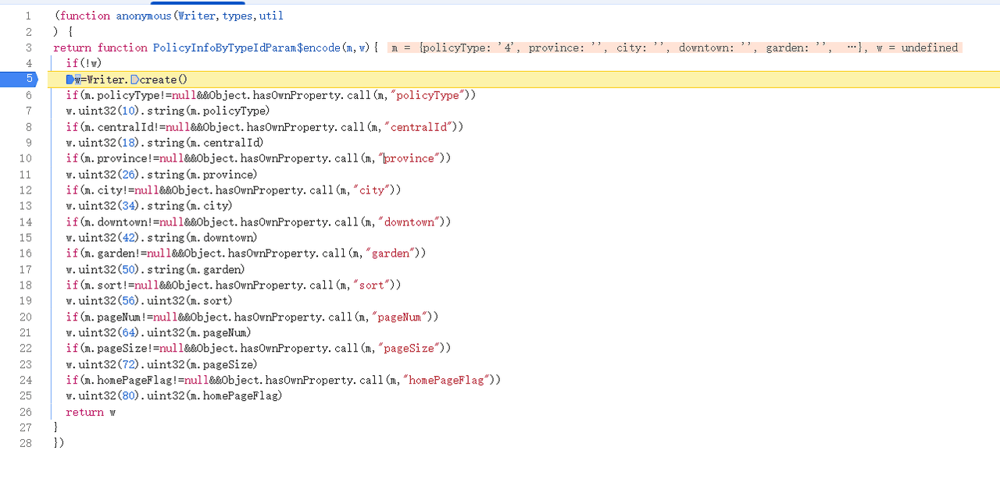

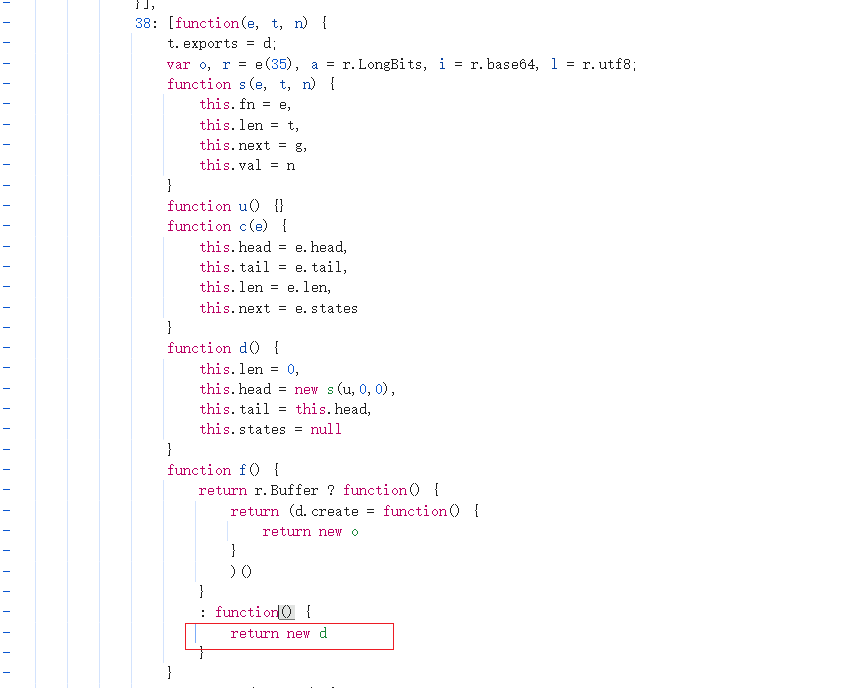

---

## 四、Webpack 模块定位

通过定位，找到了加密参数的加密位置：

1. 在 `Writer.create()` 处打断点，进入函数后定位到 `return new o`；
2. 代码呈现「`38: 内容`」这种格式，联想到 **webpack 的模块机制**；
3. 于是想到：能否拿到功能模块中 **键 `38`** 对应的函数并调用它；
4. 在网上查找到自执行函数中的**加载器（loader）**，`r2` 的功能模块就放在这个加载器函数中；
5. 需要打印 `i2`，因为最终的 `Writer.create` 函数就在 `i2` 中。

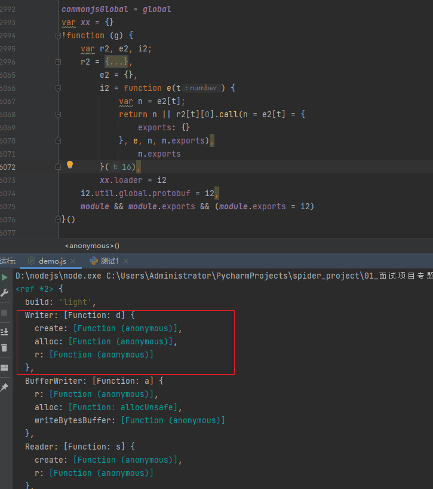

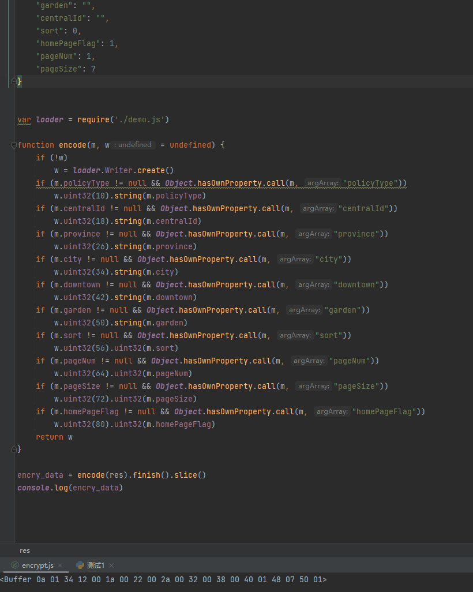

---

## 五、抠代码 + 补环境 + execjs 调用

最后通过以下三步完成破解：

- **抠代码**：将 `webpack` 中所需的加密模块（`38` 对应的模块）抽取出来；
- **补环境**：补齐该模块运行时依赖的浏览器环境（`window`、`document`、`navigator` 等）；
- **execjs 调用**：使用 Python 的 `execjs` 库调用上述 JS 代码，直接计算得到加密参数。

至此，成功破解了该平台的加密参数。
