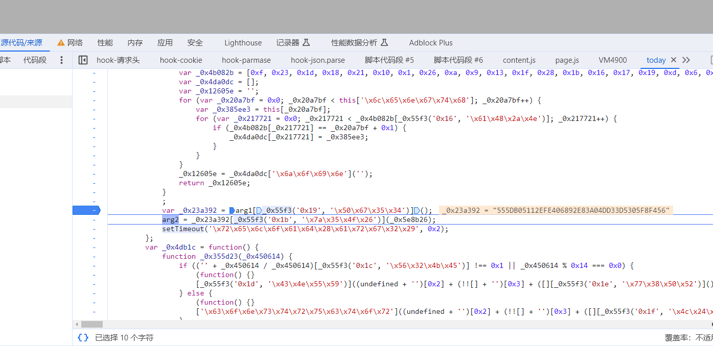
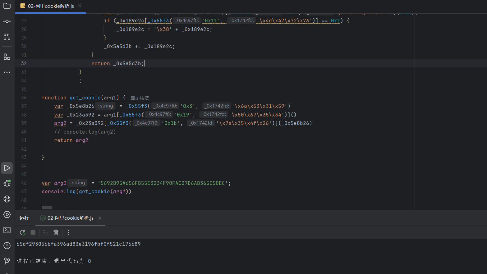

主要目标：cookie处理+js混淆处理

- 逆向cookie时需要先清空cookie,让网页重新生成
- 阿里系的cookie在重新刷新之后,会进入到debugger模式

过无限debugger

```javascript
Function.prototype.__constructor_back = Function.prototype.constructor;
Function.prototype.constructor = function() {
    if(arguments && typeof arguments[0]==='string'){
        if("debugger" === arguments[0]){
            return
        }
    }
   return Function.prototype.__constructor_back.apply(this,arguments);
}
```

通过断点调试+调用栈向上回溯的方式找到加密位置



它是一个ob混淆的代码，满足一个大数组，自执行函数用来重新排列数组的顺序，解密函数用来获取最终的数据，最终扣下来的解密函数、大数组和自执行函数都不能格式化需要通过 `https://www.sojson.com/js.html`这个工具进行压缩代码



最终js逆向的代码如上，acw_tc由服务器返回的，acw_sc__v2由js代码生成的；
第一次请求获取到响应acw_tc的cookie值和 响应的js代码，通过js代码生成acw_sc__v2; 第二次请求携带着两个cookie进行请求

最终实现的python代码

``` python
import requests  
import re  
import execjs  
  
  
def get_cookie():  
    headers = {  
        "User-Agent": "Mozilla/5.0 (Windows NT 10.0; Win64; x64) AppleWebKit/537.36 (KHTML, like Gecko) Chrome/119.0.0.0 Safari/537.36",  
    }  
  
    url = 'https://xueqiu.com/today'  
    response = requests.get(url, headers=headers)  
    arg1 = re.findall("var arg1='(.*?)';", response.text)[0]  
    acw_tc = response.cookies.get('acw_tc')  
    return arg1, acw_tc  
  
  
  
def get_data():  
    arg1, acw_tc = get_cookie()  
    with open('02-阿里cookie解析.js', encoding='utf-8')as f:  
        js_code = f.read()  
    js = execjs.compile(js_code)  
    arg2 = js.call('get_cookie', arg1)  
    headers = {  
        "User-Agent": "Mozilla/5.0 (Windows NT 10.0; Win64; x64) AppleWebKit/537.36 (KHTML, like Gecko) Chrome/119.0.0.0 Safari/537.36",  
    }  
    cookies = {  
        'acw_tc': acw_tc,  
        'acw_sc__v2': arg2  
    }  
    print(cookies)  
    url = 'https://xueqiu.com/today'  
    res = requests.get(url, headers=headers, cookies=cookies)  
    print(res.text)  
  
  
get_data()

```